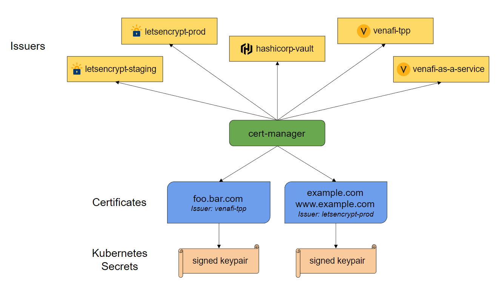
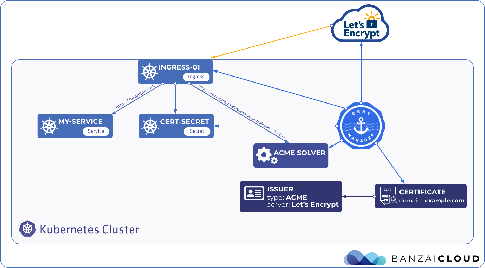
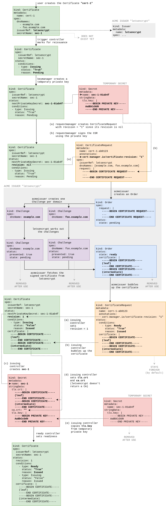

## cert-manager
[issues](https://github.com/jetstack/cert-manager/issues)


cert-manager adds certificates and certificate issuers as resource types in Kubernetes clusters, and simplifies the process of obtaining, renewing and using those certificates.

It can issue certificates from a variety of supported sources, including Let’s Encrypt, HashiCorp Vault, and Venafi as well as private PKI.

It will ensure certificates are valid and up to date, and attempt to renew certificates at a configured time before expiry.

It is loosely based upon the work of kube-lego and has borrowed some wisdom from other similar projects such as kube-cert-manager.



## Creating Certificate Resources
A Certificate resource specifies fields that are used to generate certificate signing requests which are then fulfilled by the issuer type you have referenced. Certificates specify which issuer they want to obtain the certificate from by specifying the certificate.spec.issuerRef field.

A Certificate resource, for the example.com and www.example.com DNS names, spiffe://cluster.local/ns/sandbox/sa/example URI Subject Alternative Name, that is valid for 90 days and renews 15 days before expiry is below. It contains an exhaustive list of all options a Certificate resource may have however only a subset of fields are required as labelled.

```yaml
apiVersion: cert-manager.io/v1
kind: Certificate
metadata:
  name: example-com
  namespace: sandbox
spec:
  # Secret names are always required.
  secretName: example-com-tls

  # Secret template is optional. If set, these annotations
  # and labels will be copied to the secret named example-com-tls.

  # Note: Labels and annotations from the template are only synced to the Secret at the time when the certificate 
  # is created or renewed. Currently labels and annotations can only be added, but not removed. Removing any 
  # labels or annotations from the template or removing the template itself will have no effect.
  # See https://github.com/jetstack/cert-manager/issues/4292.
  secretTemplate:
    annotations:
      my-secret-annotation-1: "foo"
      my-secret-annotation-2: "bar"
    labels:
      my-secret-label: foo

  duration: 2160h # 90d
  renewBefore: 360h # 15d
  subject:
    organizations:
      - jetstack
  # The use of the common name field has been deprecated since 2000 and is
  # discouraged from being used.
  commonName: example.com
  isCA: false
  privateKey:
    algorithm: RSA
    encoding: PKCS1
    size: 2048
  usages:
    - server auth
    - client auth
  # At least one of a DNS Name, URI, or IP address is required.
  dnsNames:
    - example.com
    - www.example.com
  uris:
    - spiffe://cluster.local/ns/sandbox/sa/example
  ipAddresses:
    - 192.168.0.5
  # Issuer references are always required.
  issuerRef:
    name: ca-issuer
    # We can reference ClusterIssuers by changing the kind here.
    # The default value is Issuer (i.e. a locally namespaced Issuer)
    kind: Issuer
    # This is optional since cert-manager will default to this value however
    # if you are using an external issuer, change this to that issuer group.
    group: cert-manager.io
```

The signed certificate will be stored in a Secret resource named example-com-tls in the same namespace as the Certificate once the issuer has successfully issued the requested certificate.

If secretTemplate is present, annotations and labels set in this property will be copied over to example-com-tls secret. Both properties are optional.

The Certificate will be issued using the issuer named ca-issuer in the sandbox namespace (the same namespace as the Certificate resource).



## Renewal
cert-manager will automatically renew Certificates. It will calculate when to renew a Certificate based on the issued X.509 certificate’s duration and a ‘renewBefore’ value which specifies how long before expiry a certificate should be renewed.

spec.duration and spec.renewBefore fields on a Certificate can be used to specify an X.509 certificate’s duration and a ‘renewBefore’ value. Default value for spec.duration is 90 days. Some issuers might be configured to only issue certificates with a set duration, so the actual duration may be different. Minimum value for spec.duration is 1 hour and minimum value for spec.renewBefore is 5 minutes. It is also required that spec.duration > spec.renewBefore.

Once an X.509 certificate has been issued, cert-manager will calculate the renewal time for the Certificate. By default this will be 2/3 through the X.509 certificate’s duration. If spec.renewBefore has been set, it will be spec.renewBefore amount of time before expiry. cert-manager will set Certificate’s status.RenewalTime to the time when the renewal will be attempted.

In a standard, secure and correctly configured TLS environment, adding a root certificate to the chain is almost always unnecessary and wasteful.

There are two ways that a certificate can be trusted:

explicitly, by including it in a trust store.
through a signature, by following the certificate’s chain back up to an explicitly trusted certificate.
Crucially, root certificates are by definition self-signed and they cannot be validated through a signature.

As such, if we have a client trying to validate the certificate chain sent by the server, the client must already have the root before the connection is started. If the client already has the root, there was no point in it being sent by the server!

### What happens if a renewal doesn’t happen? Will it be tried again after some time?
cert-manager will retry renewal if it encounters temporary failures. It uses an exponential backoff algorithm to calculate the delay between each retry.

A temporary failure is one that doesn’t mark the CertificateRequest as failed. If the CertificateRequest is marked as failed, issuance will be re-tried in 1 hour.

## CSI Driver
[Enabling mTLS]([https://link](https://cert-manager.io/docs/usage/csi/))

An experimental Container Storage Interface (CSI) driver has been created to facilitate mTLS of Pods running inside your cluster through use of cert-manager.

## Chart Hooks

Helm provides a hook mechanism to allow chart developers to intervene at certain points in a release's life cycle. For example, you can use hooks to:

Load a ConfigMap or Secret during install before any other charts are loaded.
Execute a Job to back up a database before installing a new chart, and then execute a second job after the upgrade in order to restore data.
Run a Job before deleting a release to gracefully take a service out of rotation before removing it.
Hooks work like regular templates, but they have special annotations that cause Helm to utilize them differently. In this section, we cover the basic usage pattern for hooks.

The following hooks are defined:

Annotation Value	Description
- pre-install	Executes after templates are rendered, but before any resources are created in Kubernetes
- post-install	Executes after all resources are loaded into Kubernetes
- pre-delete	Executes on a deletion request before any resources are deleted from Kubernetes
post-delete	Executes on a deletion request after all of the release's resources have been deleted
- pre-upgrade	Executes on an upgrade request after templates are rendered, but before any resources are updated
- post-upgrade	Executes on an upgrade request after all resources have been upgraded
- pre-rollback	Executes on a rollback request after templates are rendered, but before any resources are rolled back
- post-rollback	Executes on a rollback request after all resources have been modified
- test	Executes when the Helm test subcommand is invoked ( view test docs)

For example, this template, stored in templates/post-install-job.yaml, declares a job to be run on post-install:

```yaml
apiVersion: batch/v1
kind: Job
metadata:
  name: "{{ .Release.Name }}"
  labels:
    app.kubernetes.io/managed-by: {{ .Release.Service | quote }}
    app.kubernetes.io/instance: {{ .Release.Name | quote }}
    app.kubernetes.io/version: {{ .Chart.AppVersion }}
    helm.sh/chart: "{{ .Chart.Name }}-{{ .Chart.Version }}"
  annotations:
    # This is what defines this resource as a hook. Without this line, the
    # job is considered part of the release.
    "helm.sh/hook": post-install
    "helm.sh/hook-weight": "-5"
    "helm.sh/hook-delete-policy": hook-succeeded
spec:
  template:
    metadata:
      name: "{{ .Release.Name }}"
      labels:
        app.kubernetes.io/managed-by: {{ .Release.Service | quote }}
        app.kubernetes.io/instance: {{ .Release.Name | quote }}
        helm.sh/chart: "{{ .Chart.Name }}-{{ .Chart.Version }}"
    spec:
      restartPolicy: Never
      containers:
      - name: post-install-job
        image: "alpine:3.3"
        command: ["/bin/sleep","{{ default "10" .Values.sleepyTime }}"]
```

Similarly, there is no limit to the number of different resources that may implement a given hook. For example, one could declare both a secret and a config map as a pre-install hook.

When subcharts declare hooks, those are also evaluated. There is no way for a top-level chart to disable the hooks declared by subcharts.

It is possible to define a weight for a hook which will help build a deterministic executing order. Weights are defined using the following annotation:

```yaml
annotations:
  "helm.sh/hook-weight": "5"
```

## Hook deletion policies
It is possible to define policies that determine when to delete corresponding hook resources. Hook deletion policies are defined using the following annotation:

```yaml
annotations:
  "helm.sh/hook-delete-policy": before-hook-creation,hook-succeeded
```

You can choose one or more defined annotation values:

Annotation Value	Description
- before-hook-creation	Delete the previous resource before a new hook is launched (default)
- hook-succeeded	Delete the resource after the hook is successfully executed
- hook-failed	Delete the resource if the hook failed during execution

If no hook deletion policy annotation is specified, the before-hook-creation behavior applies by default.

## Use ca.crt with caution
When configuring a client to connect to a TLS server with a serving certificate that is signed by a private CA, you will need to provide the client with the CA certificate in order for it to verify the server. ca.crt will likely contain the certificate you need to trust, but do not mount the same Secret as the server to access ca.crt. This is because:

That Secret also contains the private key of the server, which should only be accessible to the server. You should use RBAC to ensure that the Secret containing the serving certificate and private key are only accessible to Pods that need it.
Rotating CA certificates safely relies on being able to have both the old and new CA certificates trusted at the same time. By consuming the CA directly from the source, this isn’t possible; you’ll be forced to have some down-time in order to rotate certificates.
When configuring the client you should independently choose and fetch the CA certificates that you want to trust. Download the CA out of band and store it in a Secret or ConfigMap separate from the Secret containing the server’s private key and certificate.

This ensures that if the material in the Secret containing the server key and certificate is tampered with, the client will fail to connect to the compromised server.

The same concept also applies when configuring a server for mutually-authenticated TLS; don’t give the server access to Secret containing the client certificate and private key.

